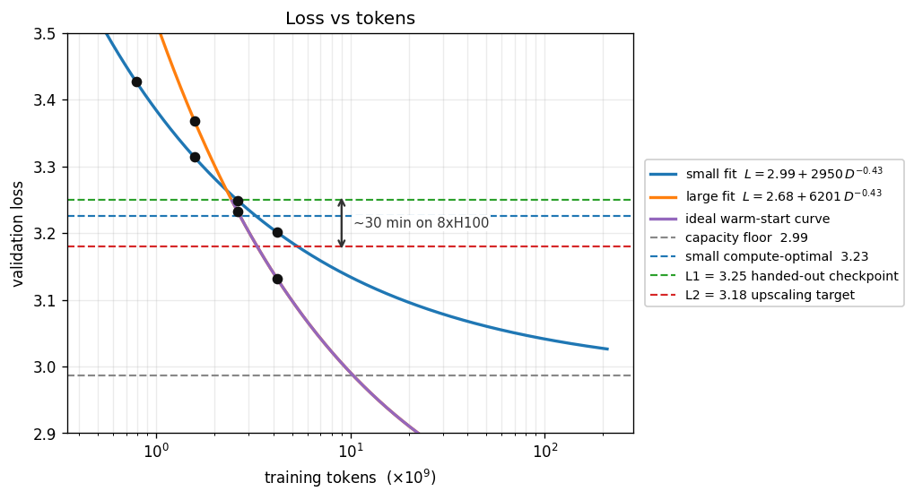
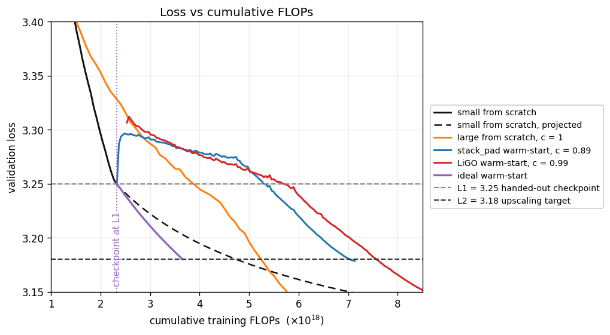

# Modded-NanoGPT Upscaling Benchmark

Imagine you are a SoTA lab and you need to ship yet another frontier model. You have squeezed everything you could out of optimizing post-training pipelines and you keep glancing at your parameter count which you know from Chinchilla has a lot of room for expansion. Also imagine the [compute crunch](https://epochai.substack.com/p/is-a-compute-crunch-coming) is finally over and you can [once again](https://epoch.ai/gradient-updates/frontier-language-models-have-become-much-smaller) afford adding more weights without increasing the token price. Off course, you do not want to let all the compute put into your previous model be wasted!

The goal of this benchmark is to find the most compute-efficient way to scale up a trained language model into a larger one.

You are given a small model and a big model, which is a scaled up version of the smaller one. The small model has been trained to the validation loss L1 = 3.25. Your task is to initialize and train the big model until it reaches the validation loss L2 = 3.18.

The smaller model at L1 is provided along with the FLOP count it took to train it. The speedrun metric is `c = warm_start_flops / from_scratch_large_flops` - the compute to reach L2 by warm-starting, relative to training the bigger model from scratch.

Out of interest we also track `c_cold = (from_scratch_small_flops + warm_start_flops) / from_scratch_large_flops`.

FLOPs are measured with `torch.utils.flop_counter.FlopCounterMode`.

## Leaderboard

| #   | c | c_cold | Description                                     | Time    | Date       | Log                                          | Contributors |
| --- | ----------- | ------ | ----------------------------------------------- | ------- | ---------- | -------------------------------------------- | ------------ |
| 1   | 0.989       | 1.428  | LiGO (fit 500), lr×0.5, warmup 50, cooldown 0.5 | ~40 min | 2026-06-28 | [log](results/upscale_ligo_lr0.5.log) | @ldmberman   |
| 2   | 0.891       | 1.330  | stack_pad, lr×0.5, warmup 50, cooldown 0.5      | ~30 min | 2026-06-28 | [log](results/upscale_stack_pad.log)  | @ldmberman   |

## Running the Current Record

```bash
python data/cached_fineweb10B.py 45   # val + 45 train shards
python -m records.track_4_upscaling.utils.download_weights small_L1.pt   # ~620 MB
torchrun --standalone --nproc_per_node=8 -m records.track_4_upscaling.run upscale
```

Train the big model from scratch:

```
torchrun --standalone --nproc_per_node=8 -m records.track_4_upscaling.run refs
```

## Rules

The rules from the [optimization track](../track_3_optimization#rules) apply.

Additionally, you cannot change the model architecture or the data pipeline. The optimizer, sequence length, batch size, and learning-rate schedule are identical for every run.

You control how you initialize the bigger model from the smaller one - which weights you freeze or keep trainable, and, in general, any weight updates you apply during training. You may not change the learning-rate schedule.

## Model Architecture

The model an early version of [`train_gpt_simple.py`](../track_3_optimization/train_gpt_simple.py) with rotary embeddings, QK-norm, ReLU2 MLPs, Muon.

Speedrun focuses on warmstarting and not general training improvements so we measure FLOPS and not the wallclock time. Consequently, for the sake of simplicity, we sacrifice training time and remove warmstart-agnostic system improvements. We keep the scored architecture in bf16 with standard dense attention. We leave out parameter banks, FP8, Triton kernels.

For fast iteration we still use tools that leave the FLOP accounting intact, mainly torch.compile and bf16.

We also sacrifice some training time for simplicity and exclude approaches that reduce architectural homogeneity like layer skipping and layer-specific activations.

## Model Sizes

The model is scaled such that it doubles in parameter count while preserving the depth to width ratio.

| dimension                            | small (given) | big (target) | ratio        |
| ------------------------------------ | ------------- | ------------ | ------------ |
| layers (depth)                       | 12            | 15           | 1.25         |
| model_dim (width)                    | 768           | 960          | 1.25         |
| attention heads                      | 12            | 15           | 1.25         |
| head_dim                             | 64            | 64           | 1.00         |
| mlp_ratio                            | 4             | 4            | 1.00         |
| transformer-block params             | 85.0M         | 166.0M       | 1.95         |
| non-embedding params (incl. LM head) | 123.7M        | 214.4M       | 1.73         |
| total params (incl. embeddings)      | 162.4M        | 262.7M       | 1.62         |

## L1 and L2

We fit the Chinchilla curve `L(D) = E_floor + B·D^(-β)` to the data obtained from a test training run and get `E_floor ≈ 2.99`, `β ≈ 0.43`.

| tokens, B | val loss |
| --------- | -------- |
| 0.79      | 3.43     |
| 1.57      | 3.31     |
| 2.62      | 3.25     |
| 4.19      | 3.20     |



The data lives in `floor_runs.csv`. To reproduce, run:

```bash
python -m records.track_4_upscaling.utils.plot_floor
```



To reproduce, run:

```bash
python -m records.track_4_upscaling.utils.plot_flops
```

## Warmup-Stable-Decay Schedule

The WSD schedule is chosen according to the realistic target loss, which would be estimated for the model of the corresponding size if it were trained in production.

| model | compute-optimal loss | compute-optimal tokens | floor loss | realistic target loss | realistic target tokens | WSD schedule length |
| - | - | - | - | - | - | - |
| small | ~3.23 | ~3.3B | ~2.99 | ~3.11 | ~16.3B | `config.SMALL_BUDGET_STEPS` |
| big | ~3.09 | ~5.3B | ~2.68 | ~2.89 | ~26.3B | `config.BIG_BUDGET_STEPS` |

Run to reproduce:

```bash
python -m records.track_4_upscaling.utils.chinchilla_budget
```

## Smoke Test

You can run the pipeline locally on CPU for development. The end-to-end check trains a tiny model on real FineWeb tokens:

```bash
git clone https://github.com/KellerJordan/modded-nanogpt.git && cd modded-nanogpt
pip install -r requirements.txt
python data/cached_fineweb10B.py 1   # val shard + 1 train shard, ~400MB
python -m records.track_4_upscaling.utils.train_fineweb_demo
```

## References

1. [Ege Erdil. "Frontier language models have become much smaller." Epoch AI (2024).](https://epoch.ai/gradient-updates/frontier-language-models-have-become-much-smaller)
2. [Ege Erdil. "Is a compute crunch coming?" Epoch AI (2024).](https://epochai.substack.com/p/is-a-compute-crunch-coming)
3. [Guilherme Penedo et al. "The FineWeb datasets." arXiv:2406.17557 (2024).](https://arxiv.org/abs/2406.17557)
4. [Tianqi Chen et al. "Net2Net: Accelerating Learning via Knowledge Transfer." arXiv:1511.05641 (2015).](https://arxiv.org/abs/1511.05641)
5. [Cheng Chen et al. "bert2BERT: Towards Reusable Pretrained Language Models." arXiv:2110.07143 (2021).](https://arxiv.org/abs/2110.07143)
6. [Peihao Wang et al. "Learning to Grow Pretrained Models for Efficient Transformer Training." ICLR 2023, arXiv:2303.00980.](https://arxiv.org/abs/2303.00980)
7. [Dahyun Kim et al. "SOLAR 10.7B: Scaling Large Language Models with Simple yet Effective Depth Up-Scaling." arXiv:2312.15166 (2023).](https://arxiv.org/abs/2312.15166)
8. [Chengyue Wu et al. "LLaMA Pro: Progressive LLaMA with Block Expansion." arXiv:2401.02415 (2024).](https://arxiv.org/abs/2401.02415)
9. [Jordan Hoffmann et al. "Training Compute-Optimal Large Language Models." arXiv:2203.15556 (2022).](https://arxiv.org/abs/2203.15556)
10. [Keller Jordan. "Muon: An optimizer for hidden layers in neural networks." (2024).](https://kellerjordan.github.io/posts/muon/)

## Citation

```
@misc{moddednanogpt_upscaling_2026,
  author       = {Keller Jordan and contributors},
  title        = {Modded-NanoGPT Upscaling Benchmark},
  year         = {2026},
  url          = {https://github.com/KellerJordan/modded-nanogpt/tree/master/records/track_4_upscaling}
}
```